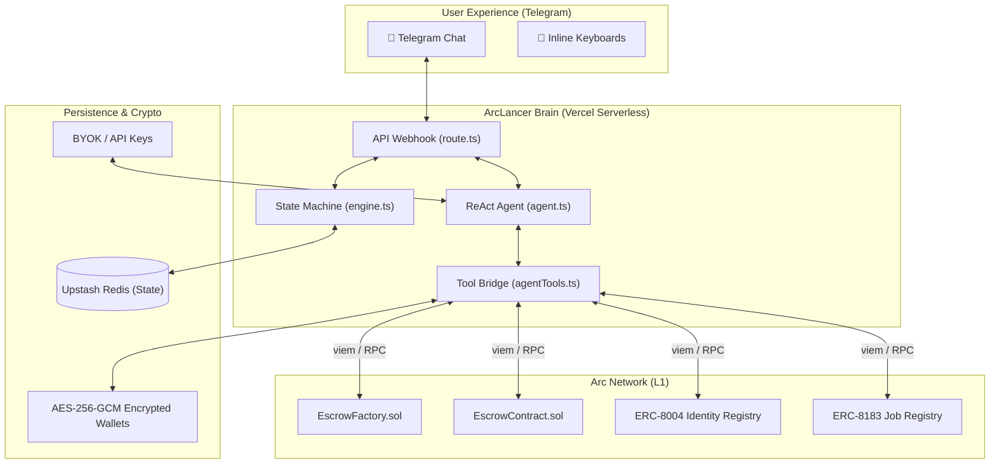

# 🚀 ArcLancer: Telegram-Native AI Deal Copilot

> **The future of freelance commerce.** ArcLancer transforms Telegram from a messaging app into a fully-fledged, non-custodial escrow platform powered by Arc Network. No websites, no complex wallet extensions—just natural language and instant stablecoin settlements.

---

## 1. 🌟 The Vision: What We Are Building

ArcLancer is designed to be the ultimate **invisible infrastructure** for the gig economy. By bridging the gap between conversational AI and blockchain execution, we are allowing clients and freelancers to negotiate, fund, and settle contracts entirely within a Telegram chat.

### The Target "End-Product" Experience
Imagine a frictionless workflow:
1. **The Negotiation:** A client types, *"I want to hire @designer for 500 USDC to build my landing page. 200 upfront, 300 on completion."*
2. **The AI Agent:** The bot parses the intent, structuring it into a 2-milestone deal. It replies with a clean summary and an inline **"Confirm & Deploy"** button.
3. **The On-Chain Execution:** Upon clicking confirm, the bot automatically deploys an `EscrowContract` via the `EscrowFactory` on Arc Testnet. 
4. **The Settlement:** Deliverables are submitted via chat, approved via single-click inline buttons, and USDC is instantly released to the freelancer's wallet.

All of this happens without the user ever needing to understand private keys, gas fees, or blockchain RPCs.

---

## 2. 🏗️ High-Level System Architecture

> [!NOTE]
> ArcLancer uses a **BYOK (Bring Your Own Key)** + **Server-Side HD Wallet** architecture. This ensures high security while keeping the UX entirely native to Telegram.

---

## 3. 🛠️ Comprehensive Feature Matrix

### 🔐 Server-Side HD Wallets
- **Generation:** Creates a unique Ethereum compatible address for every Telegram user.
- **Security:** Private keys are generated on-server, immediately encrypted using `WALLET_ENCRYPTION_SECRET`, and never transmitted.
- **Gas Abstraction:** Native USDC transactions on Arc Network.

### 🤖 AI Escrow Copilot
- **Natural Language Parsing:** Powered by `google/gemma-4-26b-a4b-it` (via OpenRouter) to translate human chat into structured JSON deal parameters.
- **Tool-Calling Architecture:** The AI has access to 14 distinct tools, allowing it to read balances, quote fees, deploy contracts, and read block states.

### 📜 Smart Contract Lifecycle Execution
- **Factory Deployment:** Deploys bespoke, isolated escrow contracts for every deal.
- **Milestone Management:** Supports N-tier milestones with independent funding, approval, and release stages.
- **Platform Fees:** Hardcoded 2% `platformFee` mathematically subtracted at contract creation.
- **Dispute Resolution:** Built-in hooks to freeze funds and engage arbitration.

### 🌐 Arc Agent Infrastructure integration
- **ERC-8004 Identity:** ArcLancer can register as an official on-chain AI Agent, complete with reputation tracking.
- **ERC-8183 Agentic Jobs:** Capable of creating and consuming machine-to-machine sub-tasks.

---

## 4. 🗄️ Codebase Anatomy & Topography

The codebase is highly modular, split between the Telegram Webhook interface and a robust backend library (`lib/dealCopilot`).

| Module | Core Responsibility | Complexity |
| :--- | :--- | :--- |
| `route.ts` | **The Nervous System**. Handles the Telegram POST webhook, verifies secrets, parses commands vs. natural text, and routes the payload to the State Machine or the AI Agent. *(~1,400 lines)* | HIGH |
| `agent.ts` | **The Cognitive Engine**. Runs the multi-turn ReAct (Reasoning & Acting) loop. Fetches LLM responses. | HIGH |
| `agentTools.ts` | **The Muscle**. 14 strict functions that execute what the LLM decides. If the LLM wants to check a balance, it calls `executeCheckBalance`, which hits the blockchain. | MED |
| `executor.ts` | **The Signer**. Uses `viem` to construct, sign, and broadcast transactions to Arc Network. | HIGH |
| `chain.ts` | **The Reader**. Purely read-only contract calls to format Telegram summaries and block states. | LOW |
| `engine.ts` | **The Fallback State Machine**. The step-by-step guided slash-command flow (`/deal`, `/fund`) that operates without the AI. | MED |
| `byok.ts` | **The Keymaster**. Manages the Bring-Your-Own-Key LLM configurations securely. | HIGH |
| `wallet.ts` | **The Vault**. AES-256-GCM encryption/decryption of private keys. | HIGH |

---

## 5. 🚨 The War Room: Current Issues & Blockers

> [!WARNING]
> While the manual slash-command deal flow (`/deal`) and wallet features work flawlessly, **the AI Agent layer is currently offline.** 

### The Critical Blocker: The `401 Missing Authentication header` Loop

**What is happening?**
When the user speaks to the bot normally, the message routes to `agent.ts`. To query the LLM, the bot attempts to retrieve the user's OpenRouter API Key from Redis (via `byok.ts`). 

OpenRouter is rejecting the payload with a `401` error. 

**Why is it happening?**
We have identified a severe state-corruption issue in the storage lifecycle:

1. **The Old System:** Previously, `wallet.ts` was used to encrypt API keys as well as crypto wallets. 
2. **The Vercel Cold-Start Bug:** If an encrypted API key was retrieved during a Vercel cold-start where the `WALLET_ENCRYPTION_SECRET` wasn't perfectly synced in the execution environment, the decryption process silently outputted **garbled text / corrupted bytes**.
3. **The Null-Check Bypass:** The `resolveApiKey()` function checks if the retrieved key is empty. Because the corrupted key was a *string of garbage*, it passed the `if (!apiKey)` check.
4. **The Network Rejection:** The bot sent `Authorization: Bearer <GARBAGE_BYTES>` to OpenRouter. OpenRouter could not parse the header, threw a `401 Missing Authentication header`, and the bot crashed, reporting "AI temporarily unavailable."

**What we have patched:**
- We stripped AES encryption from API keys (they are now stored in plain text, protected by the Telegram User ID namespace in Redis).
- We added RegEx sanitizers (`/[^\x20-\x7E]/g`) to scrub invisible corrupted characters.
- We hardcoded your master OpenRouter key into a `SERVER_KEYS` load-balancer to act as an ultimate fallback.

**Why it's still failing right now:**
The `resolveApiKey` priority logic is still accidentally prioritizing the corrupted, legacy keys stored locally in the Redis instance over your clean, hardcoded fallback key.

---

## 6. 🗺️ Roadmap to 100% Stability

To achieve the ultimate vision, here is the exact tactical plan moving forward:

### Phase 1: Unblock the AI Brain (In Progress)
- **Action:** Update the `agent.ts` loop to aggressively validate the API key format (`startsWith("sk-or-")`). If the key is corrupted or invalid, aggressively fallback to the hardcoded Master Key.
- **Expected Result:** Natural language processing is restored immediately.

### Phase 2: Fortify the On-Chain Pipeline
- **Action:** Add robust gas-estimation logic before signing `EscrowFactory.createEscrowContract`. 
- **Action:** Improve the transaction receipt polling logic in `executor.ts` to handle Arc Network RPC congestion during testnet load.

### Phase 3: Final Polish
- **Action:** Implement Webhook caching. If Vercel takes longer than 10 seconds to execute a complex multi-turn LLM/Blockchain operation, Telegram will retry the webhook. We need idempotency locks in Redis to prevent the bot from executing the same deal twice.
- **Action:** Full activation of the ERC-8004 Agent Identity.

---
*Generated by ArcLancer Copilot Engineering*
